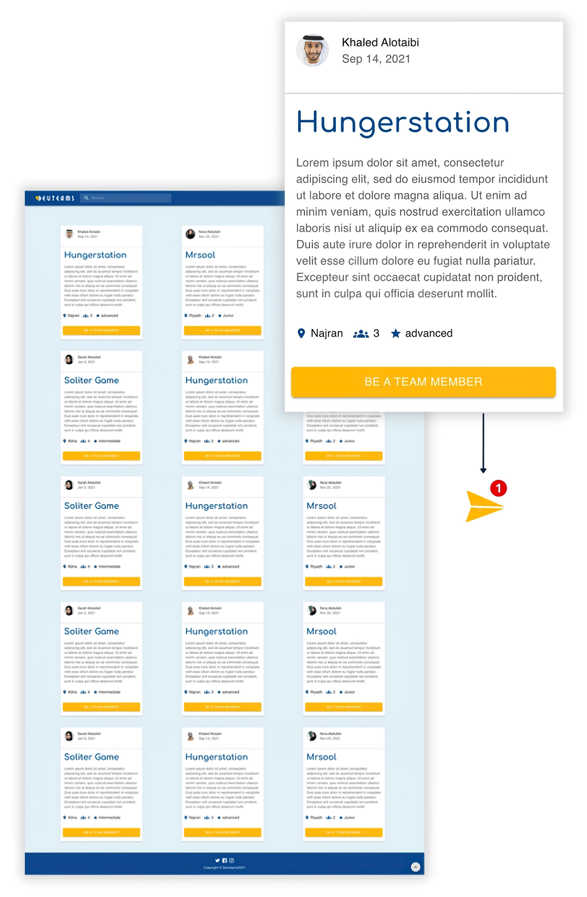
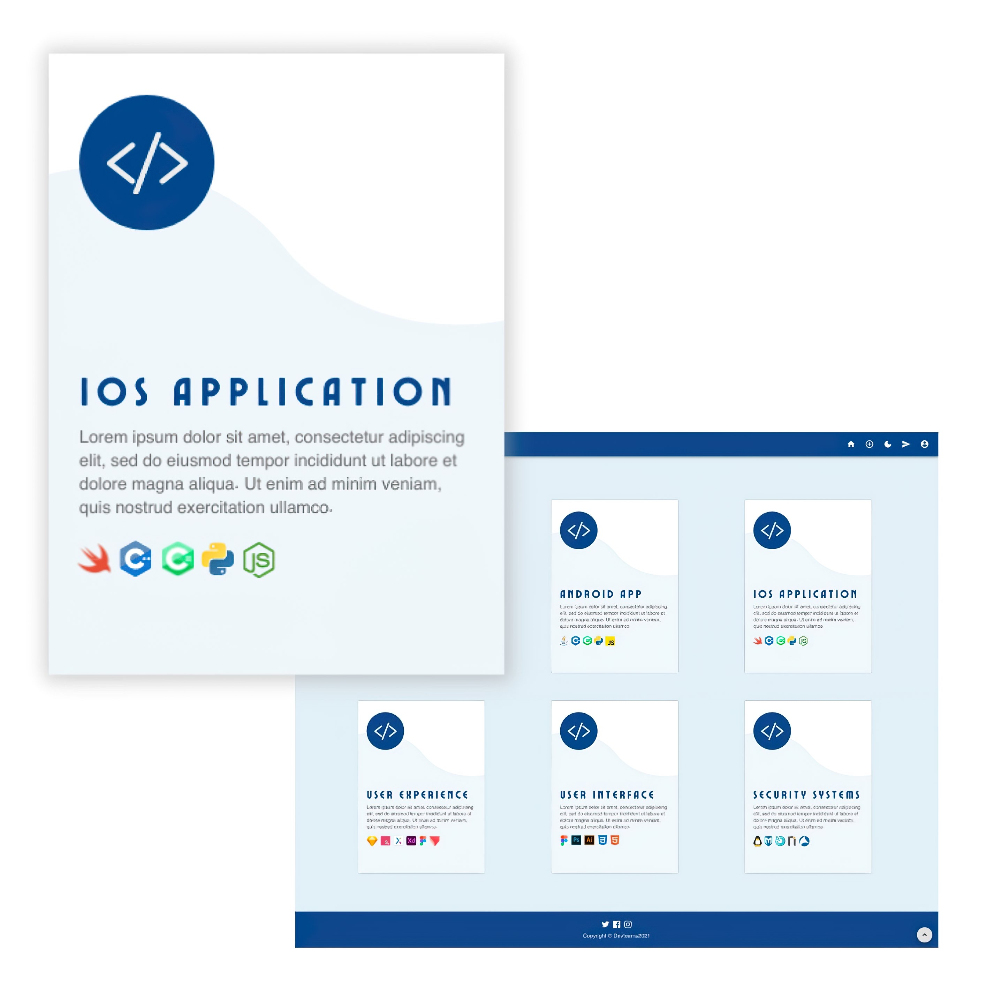

# Devteams Web Application
A web application that helps you to find like-minded developers, connect with ideal teammates, and **code better together**.


## Screenshots
- ### Light Mode
   
   
   
- ### Dark Mode
   

## Installation
1. Clone this repository:
```
git clone https://github.com/AtheerAldosari/Devteams-Web-Application.git
```
2. Install packages
```
cd Devteams-Web-Application
npm install
```
3. Run the backend
```
cd backend
npm run dev
```
4. Run the frontend
```
cd frontend
npm start
```
<!-- 2. Run the backend: -->
## Feedback
Send all feedback to [AtheerMohmed@hotmail.com](mailto:AtheerMohmed@hotmail.com)

## Contact
- [Behance](https://www.behance.net/atheermohmed)
- [Linkedin](https://www.linkedin.com/in/atheer-aldosari/)
- [Email](mailto:AtheerMohmed@hotmail.com)

